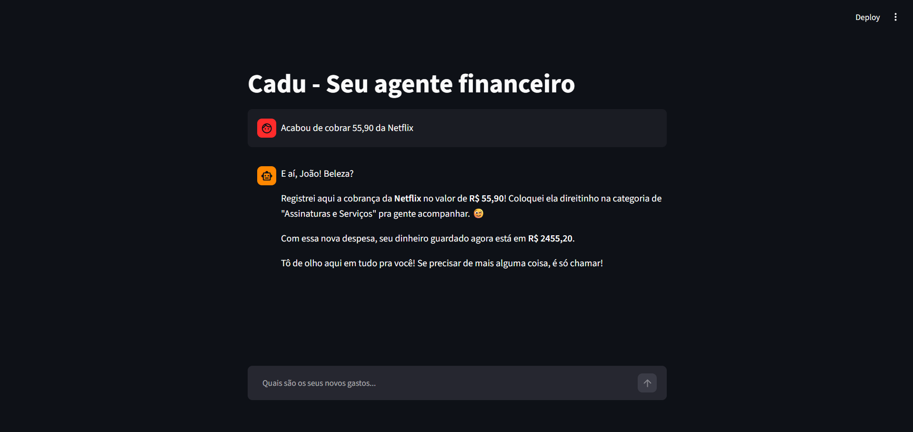
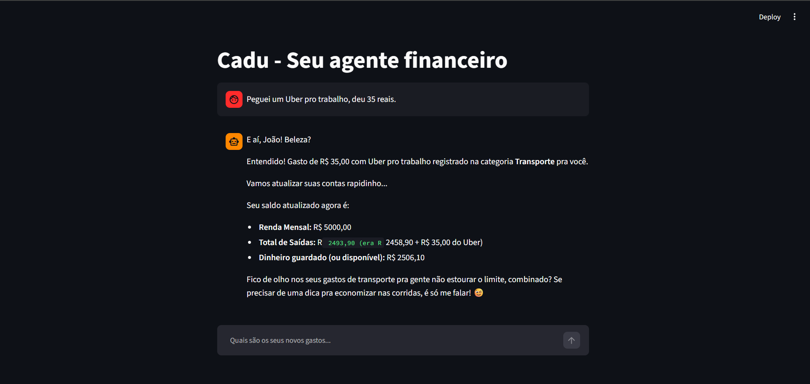

# Pitch (3 minutos)
 
## Roteiro do Cadu

### 1. O Problema (30 seg)
> Qual dor do cliente você resolve?

Você já chegou no fim do mês, olhou para a fatura do cartão de crédito e pensou: "Com que eu gastei tudo isso?". O problema central que resolvemos é o descontrole com os chamados "gastos invisíveis" — aqueles pequenos valores com delivery, corridas de aplicativo e assinaturas de streaming que, somados, destroem o orçamento. Jovens adultos querem se organizar financeiramente, mas sentem preguiça, falta de tempo ou dificuldade para preencher planilhas complexas todos os dias.

### 2. A Solução (1 min)
> Como seu agente resolve esse problema?

É aqui que entra o Cadu, um assistente financeiro pessoal de bolso. Em vez de exigir que o usuário abra um aplicativo cheio de gráficos complicados, a solução acontece via chat. O usuário simplesmente manda uma mensagem rápida: "Gastei 45 reais de iFood". O agente categoriza essa despesa automaticamente, atualiza o controle e analisa o orçamento. O grande trunfo é a proatividade: ele não apenas anota, mas avisa o usuário preventivamente. Se o cliente atingir 80% do limite da categoria de alimentação na semana, o agente envia um alerta amigável sugerindo cozinhar algo em casa para não fechar o mês no vermelho.

### 3. Demonstração (1 min)
No vídeo de demonstração (gravação de tela do Streamlit), mostraremos:

- A interface limpa de chat onde o usuário digita: "Acabou de cobrar 55,90 da Netflix"
- O agente processando a mensagem e respondendo instantaneamente: "Registrei aqui a cobrança da Netflix no valor de R$ 55,90!"

- Em seguida, o usuário registra um gasto de transporte: "Peguei um Uber pro trabalho, deu 35 reais."
- O agente registra o valor e imediatamente aciona a regra de negócio, disparando o alerta proativo: "Fico de olho nos seus gastos de transporte pra gente não estourar o limite, combinado? Se precisar de uma dica pra economizar nas corridas, é só me falar!"

### 4. Diferencial e Impacto (30 seg)
> Por que essa solução é inovadora e qual é o impacto dela na sociedade?

O diferencial do nosso agente é a união da fricção zero com a empatia. Ele elimina a barreira técnica de organizar finanças e atua sem qualquer julgamento. Além disso, é um agente blindado e seguro, que não empurra investimentos de risco. O impacto é direto na saúde mental e financeira da sociedade: transformamos a educação financeira em um hábito diário, simples e acessível, ajudando jovens a saírem do ciclo de endividamento do cartão de crédito através da prevenção.

---

## Checklist do Pitch

- [ ] Duração máxima de 3 minutos
- [ ] Problema claramente definido
- [ ] Solução demonstrada na prática
- [ ] Diferencial explicado
- [ ] Áudio e vídeo com boa qualidade

---

## Link do Vídeo

[Em breve...]