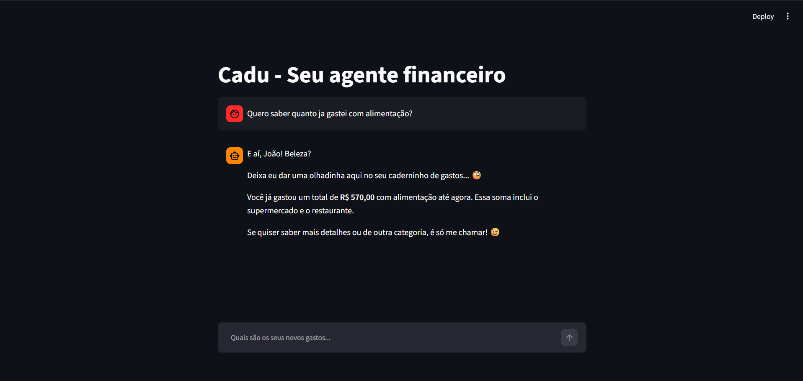

# Passo a Passo de Execução

## Setup do Gemini

```
1. Acesse https://aistudio.google.com/apikey, faça login, clique em "Criar Chave API" e copie a chave
2. Crie a pasta `.streamlit` na raiz do projeto (se não existir)
3. Dentro dela, crie o arquivo `secrets.toml`
4. Copie o conteúdo de `.streamlit/secrets.toml.example` para o `secrets.toml`
5. Cole sua chave no lugar de `sua-chave-aqui`
```

## Código Completo

Todo o código-fonte está no arquivo `app.py`.

## Como Rodar

```bash
# Instalar dependências
pip install -r requirements.txt

# Rodar a aplicação
streamlit run ./src/app.py
```

## Evidência de Execução
